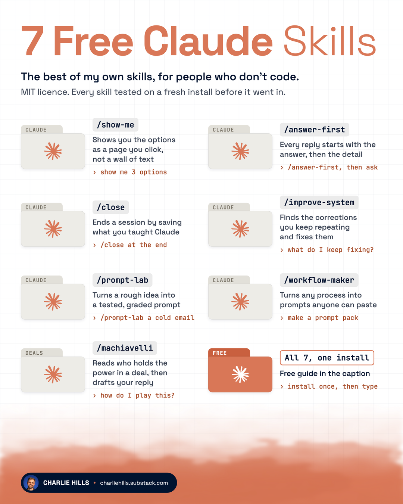

# Skills for Everyone

<p align="center"></p>

[](https://skills.sh/charlie947/skills-for-everyone)

**My Claude skills for people who use Claude every day but do not write code.**

The big skill packs are built for engineers and designers. They test code, review pull requests and tune animations. This one is for everyone else: marketers, founders, creators and operators who already live in Claude and want far more from it without becoming a developer.

These are my seven best skills. I cut the pack from 23 skills to seven, because seven strong skills beat 23 average ones. I have typed `/show-me` 557 times and `/close` 391 times. Each one fixes a job that wastes your time every week. They are small, they work on a fresh install, and they are yours to change.

If you want new skills as I build them, join my newsletter:

[Get the free guide and new skills](https://charliehills.substack.com/p/skills-for-everyone)

## Install (2 minutes)

You need [Claude Code](https://code.claude.com/docs) for the full set. Pick **one** way. Installing two gives you every skill twice.

<details open>
<summary><strong>Inside Claude Code (easiest)</strong></summary>

Type these two lines into Claude Code, one at a time.

```
/plugin marketplace add charlie947/skills-for-everyone
```

You should see a message saying the marketplace was added.

```
/plugin install skills-for-everyone@skills-for-everyone
```

You should see a message saying the plugin was installed. Type `/reload-plugins`, or close and reopen Claude Code. Your slash commands now start with the pack name, for example `/skills-for-everyone:close`. Asking in your own words works the same.

</details>

<details>
<summary><strong>Codex, Cursor or another AI tool</strong></summary>

Open the Terminal app and paste this. You need Node.js installed.

```bash
npx skills@latest add charlie947/skills-for-everyone
```

You should see the skills listed, then a question about which ones to take and which tools to install them for.

</details>

<details>
<summary><strong>Copy the files yourself (Mac or Linux)</strong></summary>

Open the Terminal app and paste these, one at a time.

```bash
git clone https://github.com/charlie947/skills-for-everyone.git ~/skills-for-everyone
```

You should see "Cloning into..." and then the prompt comes back.

```bash
mkdir -p ~/.claude/skills && cp -R ~/skills-for-everyone/skills/* ~/.claude/skills/
```

You should see nothing. That is normal. A skill you already had with the same name gets replaced.

</details>

<details>
<summary><strong>The Claude app (no Terminal)</strong></summary>

Download a skill folder from this page and zip it. In the Claude app, open Customize, then Skills, click "+", choose "Create skill", then "Upload a skill". Every plan can upload skills, including Free.

Three skills read or write files on your computer, so they need Claude Code: `show-me`, `close` and `improve-system`. The other four work in the app, using anything you paste in or the connectors you have switched on (Gmail, Calendar, Notion and so on).

</details>

**Check it worked.** In Claude Code, type `/skills`. You should see the pack in the list. If Claude Code was already open, type `/reload-skills` first.

## How these were tested

Every skill was run cold by a stranger: a fresh install, an invented business, invented emails and transcripts, nothing else to go on. Anything that confused them, broke, or could have sent, deleted or paid for something without a yes got fixed, then the skill was run again. Skills that could not pass were cut from the pack.

## Why these skills exist

### #1: Claude tells you about the work instead of showing you

**The problem.** You ask for a plan or three headline options and get four paragraphs describing them. You read it twice, still cannot picture it, and have to choose anyway.

**The fix.** [`/show-me`](./skills/show-me/SKILL.md) turns any plan, comparison or set of options into a page that opens in your browser, with a button on each option to pick it. [`/answer-first`](./skills/answer-first/SKILL.md) moves the answer from paragraph four to sentence one, for the whole conversation.

### #2: Claude forgets what you taught it

**The problem.** You correct Claude all afternoon, close the window, and next week it makes the same mistakes.

**The fix.** [`/close`](./skills/close/SKILL.md) ends a good session by saving the lessons worth keeping and rejecting the rest. [`/improve-system`](./skills/improve-system/SKILL.md) reads a week of your prompts and finds the corrections you keep repeating, then fixes them at the source.

### #3: You use 10% of what Claude can do

**The problem.** Most people install Claude Code, type a prompt and stop. Your best prompts live in old chats, and the processes in your head are ones nobody else can run.

**The fix.** [`/prompt-lab`](./skills/prompt-lab/SKILL.md) turns a rough idea into a tested prompt, graded against Anthropic's current guidance. [`/workflow-maker`](./skills/workflow-maker/SKILL.md) turns a process you run into a prompt pack anyone can paste and run.

### #4: A deal goes quiet

**The problem.** A client goes quiet. A partner pushes terms. A buyer names a number below yours. From inside the thread you cannot see who holds the power.

**The fix.** [`/machiavelli`](./skills/machiavelli/SKILL.md) reads a stalled deal for who holds the power, picks the play and writes the message.

## Which skill do I need?

| You want to... | Use |
| --- | --- |
| See something instead of reading about it | `show-me` |
| Get shorter, clearer replies | `answer-first` |
| Make Claude remember this session's lessons | `close` |
| Stop repeating the same corrections every week | `improve-system` |
| Turn a rough idea into a tested prompt | `prompt-lab` |
| Share a process as prompts other people can run | `workflow-maker` |
| Work out how to handle a client, a deal or a negotiation | `machiavelli` |

## Reference

Some skills run when you ask for them, by slash command or in your own words. Others Claude also reaches for on its own when the job fits.

### Work with Claude

**You ask for it**

- **[close](./skills/close/SKILL.md)**: End a good session properly. Saves the lessons worth keeping, finishes loose ends, and tells you if anything is still open. [Docs](./docs/close.md)
- **[improve-system](./skills/improve-system/SKILL.md)**: Reads a week of your prompts, finds the corrections you keep repeating, and fixes them at the source. [Docs](./docs/improve-system.md)
- **[prompt-lab](./skills/prompt-lab/SKILL.md)**: Turns an idea into a finished prompt, graded against Anthropic's current guidance and run before you get it. [Docs](./docs/prompt-lab.md)
- **[workflow-maker](./skills/workflow-maker/SKILL.md)**: Turns a process you run into a numbered prompt pack a stranger can paste and run. [Docs](./docs/workflow-maker.md)

**Claude reaches for it**

- **[show-me](./skills/show-me/SKILL.md)**: Puts the finished thing in front of you as a page in your browser, instead of describing it. [Docs](./docs/show-me.md)
- **[answer-first](./skills/answer-first/SKILL.md)**: Puts the answer in the first sentence of every reply. No preamble, no waffle. [Docs](./docs/answer-first.md)

### Deals and clients

**Claude reaches for it**

- **[machiavelli](./skills/machiavelli/SKILL.md)**: Reads a business situation for who holds the power, picks the play and writes the message. [Docs](./docs/machiavelli.md)

## What these skills will never do

- Send a message, publish a post or spend money on your behalf. Anything that goes out, you send.
- Delete a record, a file or one of your rules without asking you first.
- Send your files or history anywhere. The scripts run on your computer.

## Licence

MIT. See [LICENSE](./LICENSE). Rules 1 to 10 of `answer-first` are adapted from the open-source i-have-adhd project, MIT licensed, and the credit is kept in the skill and the licence.

Built by [Charlie Hills](https://charliehills.substack.com).
